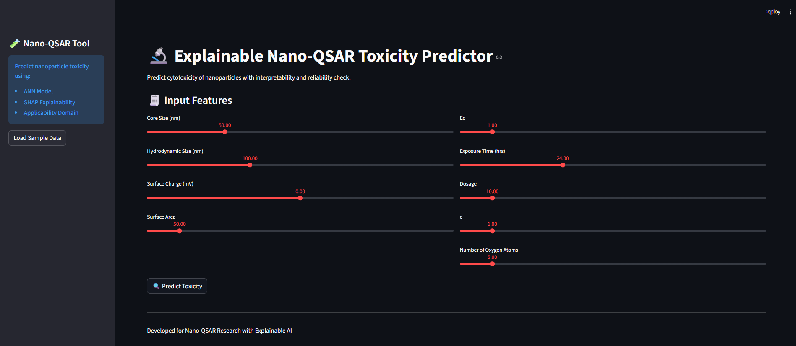

# 🧠 Explainable ANN-Based Nano-QSAR Model for Cytotoxicity Prediction

## 📌 Overview

This project presents an **Explainable Artificial Neural Network (ANN)-based Nano-QSAR model** for predicting nanoparticle-induced cytotoxicity. The model integrates **SHAP (Explainable AI)** and **Applicability Domain (AD)** analysis to ensure interpretability and reliability.

---

## 🚀 Features

* ✅ ANN-based cytotoxicity prediction
* ✅ Explainable AI using SHAP
* ✅ Applicability Domain validation
* ✅ Interactive GUI using Streamlit
* ✅ High performance (97%+ accuracy)

---

## 📊 Model Performance

| Metric    | Value  |
| --------- | ------ |
| Accuracy  | 97.17% |
| Precision | 100%   |
| Recall    | 94.04% |
| F1 Score  | 96.93% |

---

## 🧪 Input Features

* NPs
* Core Size
* Hydrodynamic Size
* Surface Charge
* Surface Area
* Ec
* Exposure Time
* Dosage
* e
* NOxygen

---

## 🧠 Explainability

SHAP (SHapley Additive exPlanations) is used to interpret model predictions by quantifying feature contributions.

---

## 📸 Results

### Confusion Matrix


### ROC Curve


### SHAP Feature Importance


### GUI Interface



---

## 🖥️ GUI Usage

Run the app:

```bash
streamlit run app.py
```

Then open:

```
http://localhost:8501
```

---

## ⚙️ Installation

```bash
pip install -r requirements.txt
```

---

## 📂 Project Structure

```
app.py → GUI  
nano_model.h5 → Trained model  
scaler.pkl → Feature scaler  
X_train.npy → Training data  
```

---

## 👨‍💻 Authors

* Rizly Azhar (B23F0005AI205)
* Afnan Roobi (B23F0009AI203)
* Asjadh Zakee (B23F0004AI204)
* Syed Abbas (B23F0001AI008)

---

## 📚 Keywords

Nano-QSAR, ANN, Explainable AI, SHAP, Cytotoxicity Prediction

---

## 🏆 Conclusion

This project demonstrates a robust, explainable, and deployable Nano-QSAR framework with real-world applicability in nanotoxicology and healthcare.

---
